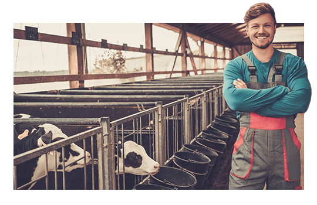

# Doane Agribusiness landing page 

Doane has launched a new program called Agribusiness. This microsite is built to advertise this program and drive traffic to their offline and online marketing efforts. 

## Getting Started

These instructions will describe how to activate different features of the microsite for future use. 

1. Testimonials
2. Pop out sections
3. Cut out photos

## 1. Testimonials

### Types of testimonials
There are 3 different types of testimonials. A featured image testimonial, one with the testimonial image on top and one with the image to the right. 

##### Featured Image testimonial
This testimonial has a large featured image with a testimonial featured in the bottom right hand corner. Featured image should be roughly 900 x 530. 
````
<div class="section_wrapper section_imgtestimonial" data-paroller-factor="0.1" data-paroller-type="foreground">
	<div class="section">
		
		<div class="section_testimonial ">
			<div class="testimonial_image">
				
			</div>
			<div class="testimonial_content">
				<p>I’ve known agriculture my whole life; I’ve always been drawn to it. I know that there’s more I can do to improve efficiency, safety, and profitability. I’m looking for a program that can help me do that.</p>
				<span class="author">Bryan Lukeing</span>
			</div>
		</div>
	</div>
</div>
````

##### Image top testimonial
This testimonial does not have a featured image and the testimonial photo is featured on top of the testimonial box.
````
<div class="section_wrapper section_texttestimonial_top">
	<div class="section">
		<div class="section_testimonial" data-paroller-factor="0.1" data-paroller-type="foreground">
			<div class="testimonial_image">
				
			</div>
			<div class="testimonial_content">
				<p>I’ve always loved technology and seeing how it can apply to almost anything. Agriculture has a unique opportunity where we can change an old industry with today’s technology.</p>
				<span class="author">Charlie Smith</span>
			</div>
		</div>
	</div>
</div>
````

##### Image Right testimonial
This testimonial is the same as the Image top testimonial except that the testimonial image is now on the right.
```
<div class="section_wrapper section_texttestimonial_right">
	<div class="section">
		<div class="section_testimonial" data-paroller-factor="0.1" data-paroller-type="foreground">
			<div class="testimonial_image">
				
			</div>
			<div class="testimonial_content">
				<p>I’ve been looking at agribusiness as a way to get into the food industry and improving sustainability, agroecology, and helping people understand where their food comes from.</p>
				<span class="author">Shannon Johnson</span>
			</div>
		</div>
	</div>
</div>
```
### Setting up the testimonials on  a page
Paste the above code after a section_wrapper div to add a testimonial to the page. You'll also need to add a class of "popoutisnext" to the previous section_wrapper div to make the testimonial overlap sections. See the below code for an example.
````
<div class="section_wrapper section_stat stat_three popoutisnext">
	<div class="section">
		<p class="stat">
			<span class="number"><span class="count" data-count="914527657">0</span></span>
					<span class="text">Total farmland acres in the&nbsp;United&nbsp;States.</span>
					<span class="stat_source">-USDA.GOV</span>
				</p>
			</div>
		</div>
		<div class="section_wrapper section_texttestimonial_right">
			<div class="section">
				<div class="section_testimonial" data-paroller-factor="0.1" data-paroller-type="foreground">
					<div class="testimonial_image">
						
					</div>
					<div class="testimonial_content">
						<p>I’ve been looking at agribusiness as a way to get into the food industry and improving sustainability, agroecology, and helping people understand where their food comes from.</p>
						<span class="author">Shannon Johnson</span>
					</div>
				</div>
			</div>
		</div>
````

## 2. Popout sections

Setting up a pop out section is very similar to setting up a testimonial. You'll have to add a class of "popoutisnext" to the section_wrapper before your popout section code.

```
<div class="section_wrapper popout_image" data-paroller-factor="0.05" data-paroller-type="foreground">
	<div class="section">
		
	</div>
</div>
```

## 3. Cut out photos
Cut out photos allow for a max of a 30px cutout in any direction. See the template provided for reference. When you add a cutout photo to a design add a class of "cutout" to make sure the image is treated correctly in the code.

````

````


## Questions
For any additional questions on how to add new content to the template contact Becca at becca@skwintz.com 